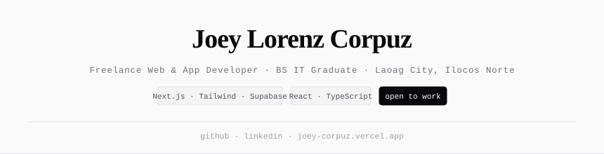

---

## 01 — about

Freelance web & app developer building modern interfaces and apps. Focused on generative AI and full-stack systems. I turn rough ideas into things people actually use.

`2+ projects shipped` &nbsp;&nbsp; `NC II · Computer System Servicing` &nbsp;&nbsp; `BS IT Graduate — DCCP Laoag` &nbsp;&nbsp; `open to work`

---

## 02 — projects

**[BIS Portal](https://bisportal.vercel.app/) ↗**
Digital school management system for Balatong Integrated School — student records, SF10-JHS export, QR attendance, grades management, learning modules.
`Next.js` `React` `Tailwind CSS` `Supabase` `TypeScript` · 2026

**[Faith Files](https://faithfiles.vercel.app/#/portal) ↗**
Centralized portal for parish mass schedules with an admin dashboard for managing church operations.
`Next.js` `Firebase` `Tailwind CSS` · 2025

**[Ticket Trek](https://ticket-trek-movie.vercel.app/) ↗**
Cinema seat reservation system with movie browsing and real-time seat booking.
`React` `Firebase` `JavaScript` · 2025

---

## 03 — stack

**Frontend**
`HTML` `CSS` `JavaScript` `TypeScript` `React` `Next.js` `Tailwind CSS`

**Backend & Database**
`Node.js` `PHP` `Python` `MySQL` `MongoDB` `Firebase` `Supabase`

**Languages**
`Java` `C++`

**Tools**
`Git` `GitHub` `Figma` `n8n` `Apache` `Networking` `OS Install` `Hardware`

---

## 04 — experience

**Freelance Web & App Developer** · Self-employed &nbsp; `2023 – Present`

**IT Support Technician (OJT)** · Plaza del Norte Hotel · Keener's Inc., Laoag City &nbsp; `2025`

**NC II — Computer System Servicing** · Data Center College of the Philippines, Vigan City &nbsp; `2025`

---

## 05 — recommendations

> *"Joey didn't just show up to our OJT — he showed initiative. He diagnosed network issues that had been bothering us for weeks, and he did it without being asked. That's rare for an intern."*
>
> **Yachi Hollanda** · Hotel Manager, Plaza del Norte Hotel

> *"Most interns need constant hand-holding. Joey was the opposite — he'd ask the right questions once, then figure out the rest on his own. Our network rehabilitation project moved faster because of him."*
>
> **James Rick** · IT Supervisor, Keener's Inc.

---

## 06 — activity

<picture>
  <source media="(prefers-color-scheme: dark)" srcset="https://raw.githubusercontent.com/dvshaoo/dvshaoo/output/github-snake-dark.svg"/>
  <source media="(prefers-color-scheme: light)" srcset="https://raw.githubusercontent.com/dvshaoo/dvshaoo/output/github-snake.svg"/>
  
</picture>

 

---

## 07 — contact

- Portfolio — [joey-corpuz.vercel.app](https://joey-corpuz.vercel.app/) ↗
- GitHub — [dvshaoo](https://github.com/dvshaoo) ↗
- LinkedIn — [joey-lorenz-corpuz](https://www.linkedin.com/in/joey-lorenz-corpuz-1b991b398/) ↗
- Email — [paleraciojoey68@gmail.com](mailto:paleraciojoey68@gmail.com) ↗

---

inspired by <a href="https://bryllim.com">bryllim.com</a> · <a href="https://joey-corpuz.vercel.app">portfolio</a>

